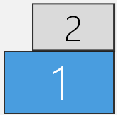

# MoveMonitors

A little Windows only script to change the position of a secondary monitor relative to the position of the primary monitor.


### Setup

```
git clone https://github.com/Crozzers/MoveMonitors.git
pip install -r requirements.txt
```

### Usage

```
> python move_monitor.py --help
usage: move_monitor.py [-h] {list,move} ...

positional arguments:
  {list,move}
    list       List displays
    move       Move a display

options:
  -h, --help   show this help message and exit

> python move_monitor.py move --help
usage: move_monitor.py move [-h] display {top,left,bottom,right} [{top,left,bottom,right,center}]

positional arguments:
  display               The index of the display to move
  {top,left,bottom,right}
                        Move to this side of the primary display
  {top,left,bottom,right,center}
                        [optional] align to this edge of the chosen side

options:
  -h, --help            show this help message and exit
```

### Examples

Command                                       | Result                  
----------------------------------------------|---------------------------
`python move_monitor.py move 1 left`          | 
`python move_monitor.py move 1 left bottom`   | 
`python move_monitor.py move 1 top right`     | 
`python move_monitor.py move 1 right top`     | 
`python move_monitor.py move 1 bottom center` | 
